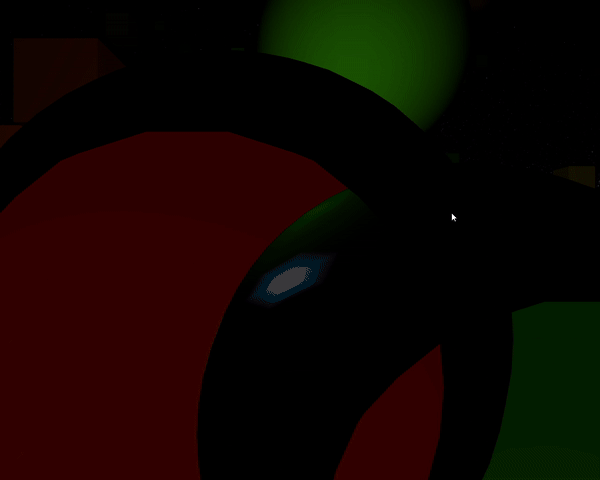

# CIU-P5-iluminacionSubmarina
## Autor
Jacobo Placeres Cabrera

## Trabajo
El proyecto consiste en una nave que se encuentra en un extraño lugar donde se puede observar varias cubos y esferas, implementa un 
sencillo sistema de iluminacion

## Eventos
Se emplea el teclado para mover la nave.

## Librerias empleadas
No se ha empleado ninguna librería.

## Vista Nave
 Se coloca detras de la nave, en este modo se puede mover libremente la cámara.
 
## Notas de uso
+**WA** Permiten desplazar la nave arriba o abajo.
+**AD:** Permite Rotar la nave a la izquierda o derecha.
+**FlechaDerecha/FlechaIzquierda:** Mueve la nave a la derecha o a la izquierda.
+**FlechaArriba/FlechaAbajo:** Mueve la nave a hacia arriba o hacia abajo.

## Referencias
**[Reference](https://processing.org/reference)**

**[Texturas](https://www.solarsystemscope.com/textures/)**
